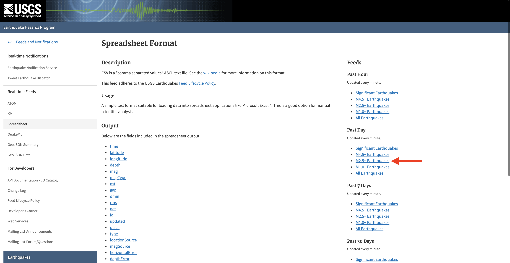
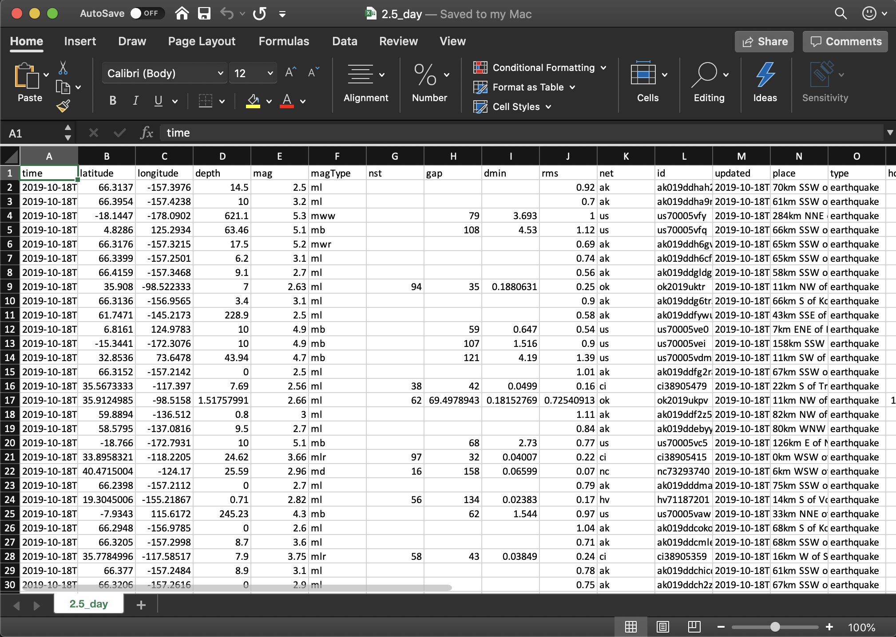
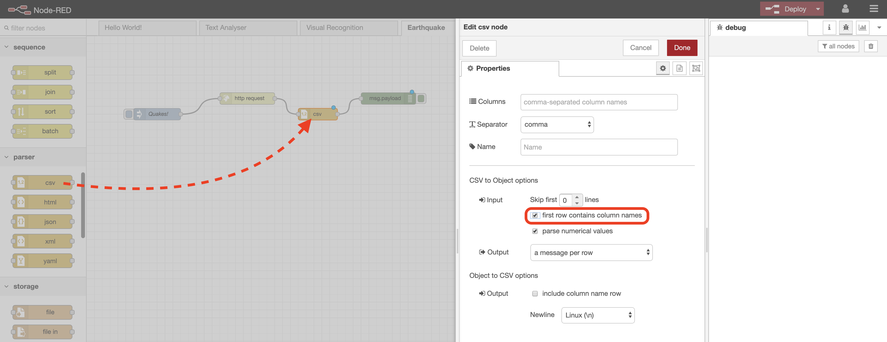
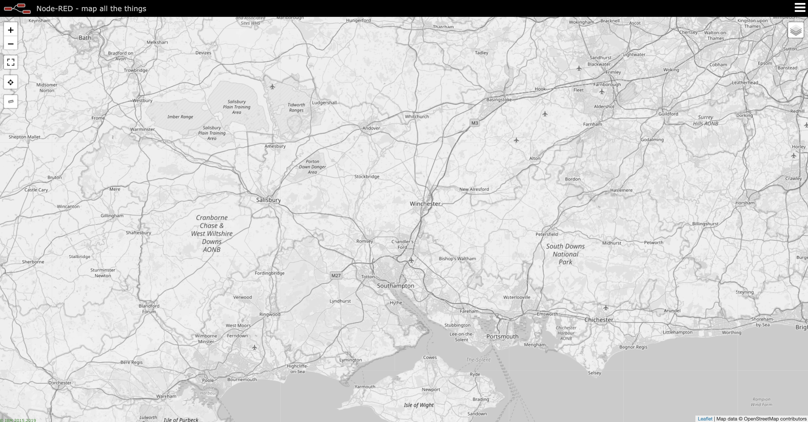
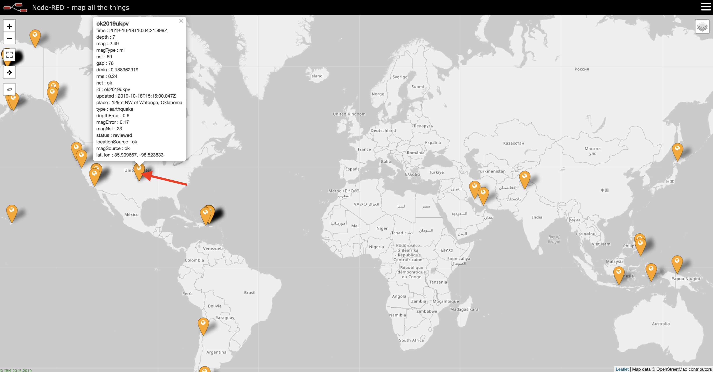

# **Lab 6:** _Building an Earthquake Mapping Application_
As we've seen, Node-RED has a great community base, so if you want to use Node-RED to interact with your [Amazon Echo](https://flows.nodered.org/node/node-red-contrib-amazon-echo), [access Google services](https://flows.nodered.org/node/node-red-node-google), [send SMS messages](https://flows.nodered.org/node/node-red-contrib-sms-twilio), [interact with Reddit](https://flows.nodered.org/node/node-red-contrib-node-reddit), or [get photos from Instagram](https://flows.nodered.org/node/node-red-node-instagram), somebody out there has already written Node-RED nodes that you can download and use.

Here, we're going to build an app that takes recent raw earthquake data from the United States Geological Survey (USGS) [website](https://www.usgs.gov/), and highlights recent significant seismic activity on a map.

Fortunately, nodes that automatically produce interactive maps from sets of co-ordinates have already been created: **Worldmap** nodes. If you want to understand more about how these work, click [here](https://flows.nodered.org/node/node-red-contrib-web-worldmap).

**(1)** As the **Worldmap** nodes are not present by default in Node-RED, we need to import them.  Add a new tab to your editor and call it `Earthquake`, then use the `burger icon` and select `Manage Palette`.


**(2)** Select the `Install` tab on the window that appears, then type in `worldmap`, then `Install` on the `node-red-contrib-web-worldmap` item.


The nodes will install into your Node-RED environment, and you'll get a confirmatory message.

**(3)** To start with we'll prove that we can access the data we need. Add `Inject`, `HTTP Request` and `Debug` nodes.

Modify the Inject node, by renaming it to `Quakes!` Note here that you can also use `Inject` nodes to schedule actions via the `Repeat` field. So, for example, if you wanted to automatically retrieve updated data on an hourly or daily basis, you could do that via this field.


**(4)** The data we want to retrieve is held at the [USGS earthquake website](https://earthquake.usgs.gov). The USGS helpfully provide seismic activity data in multiple formats - we'll use a real-time feed of data listing every earthquake over the last 24 hours with a strength of over 2.5.



[This link](https://earthquake.usgs.gov/earthquakes/feed/v1.0/csv.php) will take you to the a page that allows you to download the latest earthquake data in spreadsheet format. The data looks something like this:



**(5)** We're going to use Node-RED to extract the data fields that we require from this spreadsheet, and plot this real-time seismic activity on a map.

The full URL for the spreadsheet is https://earthquake.usgs.gov/earthquakes/feed/v1.0/summary/2.5_day.csv, so let's plug that into our `HTTP Request` node.

_Important: make sure you also **untick** the `Append msg.payload as query string parameters` box._  

Everything else can be left to default.


**(6)** Connect up these nodes, hit `Deploy`, then hit the `Inject` button. Your flow will then retrieve the data from the spreadsheet on the USGS website, and output it as a message in the debug window.


You can see here that this is just a text dump of the data from the spreadsheet, so we're going to have to find a way of extracting and manipulating the information that we need.

**(7)** Drop a `CSV` node into your flow between the `HTTP Request` and the `Debug` nodes, and edit its properties.

This rather useful node can take a spreadsheet file in CSV format as input, and convert it to a data structure that can then be manipulated by other Node-RED nodes or programming languages such as Javascript. _It also works the other way, if you want to convert data to CSV format._

The only change you need to make in the node properties, is to ensure the `first row contains column names` field is **ticked**. If you look back at how the spreadsheet looks (step 5), you'll see that it has column names in the first row, so this option informs the `CSV` node to expect a first row that consists of column names, rather than data.



**(8)** Once again, ensure the nodes are connected up, hit `Deploy`, then hit the `Inject` button. This time you should see an individual message outputted for **each** row of the spreadsheet, in the debug window.

If you click on one of the messages you can expand it to see the data associated with each row, including _time, latitude, longitude, magnitude (mag), place,_ etc.


**(9)** Now we know we're getting the data correctly, we can now filter what we need, and send it to our `worldmap` node for display.

Delete the `Debug` node, as we no longer need it, then drop in a `Function` and a `Worldmap` node.

Edit the `Function` node. Call it `extract data for map` and copy in this code:

```javascript
msg.payload.lat = msg.payload.latitude;
msg.payload.lon = msg.payload.longitude;
msg.payload.layer = "earthquake";
msg.payload.name = msg.payload.place;
msg.payload.icon = "globe";
msg.payload.iconColor = "orange";

delete msg.payload.latitude;
delete msg.payload.longitude;
return msg;
```


This node takes each individual message passed from the `CSV` node, and reformats the data in the way that the `Worldmap` node is expecting it.

For example, the `CSV` node passes the _longitude_ of the earthquake on as `msg.payload.longitude` (_longitude_ being the column name extracted from the USGS spreadsheet), and if you look at the [Worldmap documentation](https://flows.nodered.org/node/node-red-contrib-web-worldmap), you'll see that a `Worldmap` node expects to receive a _longitude_ in `msg.payload.lat`.

There are a few other variables set here, some of which are involved with formatting of the map itself. Go to the [Worldmap documentation](https://flows.nodered.org/node/node-red-contrib-web-worldmap) to see how you can further customise maps, icons, colours, etc.

**(10)** The `Worldmap` node itself doesn't need any customisation in this instance, so go ahead and wire the nodes up, hit `Deploy`, then the `Inject` button.


**(11)** The `Worldmap` interface is accessed via a URL that is constructed from your Node-RED application name, plus `/worldmap`.

Copy the URL from your Node-RED application up to and including `mybluemix.net/` and then append `/worldmap` to get your `Worldmap` URL.

So for example, if your Node-RED application URL was:

https://node-red-garywilson.eu-gb.mybluemix.net/

your Worldmap URL would be

https://node-red-garywilson.eu-gb.mybluemix.net/worldmap/

Copy this Worldmap URL into your browser, and you should see something like this:



**(12)** OK, so we have a map, but it doesn't look very exciting, and we certainly can't see any seismic activity yet. But, if you `zoom out` several times until you get a whole world map view, you should see something like this:


These are the positions of all of the earthquakes of 2.5+ magnitude that have occurred in the past 24 hours. Cool, eh?

And if you select any of them, you get all of the associated data about the quake:



There are some other `Worldmap` nodes that allow you to preset different map types, zoom levels, etc. Again, first place to go for this is the [Worldmap documentation](https://flows.nodered.org/node/node-red-contrib-web-worldmap).

**Another one done! This lab demonstrates how you can interface with third party data using Node-RED, and also how you can use mapping capabilities when your data includes co-ordinate information. Next on our list is [Lab 7](../7-Translation) where you'll see how to build a cool translation app.**
